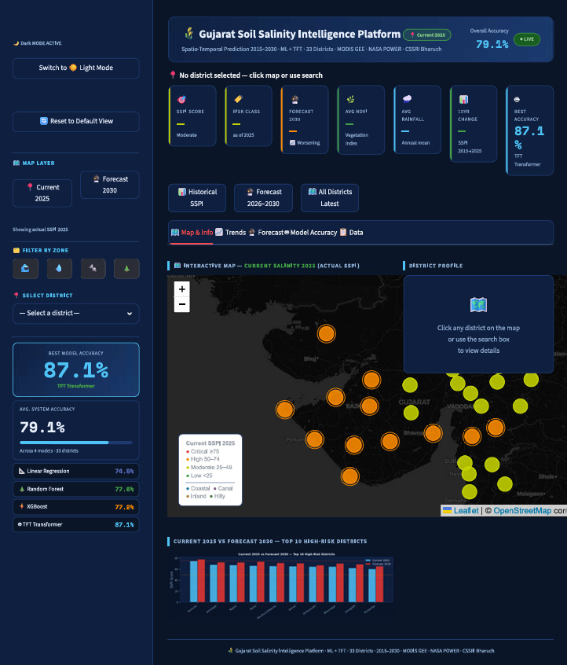

# 🌾 Gujarat Soil Salinity Intelligence Platform

### AI-Powered Geospatial Monitoring, Forecasting & Decision Support System for Soil Salinity Management


---

# 📸 Dashboard Preview



---

# 🎥 Project Demonstration

👉 Interactive AI-powered dashboard for monitoring and forecasting soil salinity across 33 Gujarat districts, spanning 2015–2030.

📹 [Watch the full demo](screenshots/Demo.mp4)

---

# 📌 Project Overview

Soil salinity is one of the most serious land degradation challenges affecting agricultural productivity, groundwater quality, and long-term sustainability in arid and semi-arid regions.

The **Gujarat Soil Salinity Intelligence Platform** is a Geospatial Artificial Intelligence (GeoAI) system that monitors, analyzes, predicts, and visualizes soil salinity dynamics across **33 districts of Gujarat**, spanning **2015–2030**.

The platform integrates:

* District-level geospatial boundaries
* NASA POWER climate data (rainfall, temperature)
* MODIS NDVI vegetation indicators (via Google Earth Engine)
* Reference salinity parameters from CSSRI Bharuch (Central Soil Salinity Research Institute)
* Classical machine learning models
* Deep learning (temporal) forecasting

to generate a district-level **Soil Salinity Prediction Index (SSPI)** for researchers, planners, and policymakers, combining **GIS, Machine Learning, Deep Learning, Forecasting, and Interactive Web Mapping** into a single decision-support platform.

---

# 🎯 Project Objectives

* Monitor district-wise soil salinity conditions
* Generate a Soil Salinity Prediction Index (SSPI)
* Identify salinity-prone regions
* Analyze historical salinity trends (2015–2025)
* Forecast future salinity conditions (2026–2030)
* Compare machine learning model performance
* Support agricultural planning and land management
* Provide actionable recommendations for mitigation

---

# 🌍 Study Area

### State: Gujarat, India — 33 Districts

Gujarat contains extensive coastal zones, canal command areas, inland dry regions, and groundwater-dependent agricultural districts, making it one of India's most important regions for salinity assessment.

The platform classifies districts into four zone types:

* Coastal Districts
* Canal Irrigation Zones
* Inland Agricultural Regions
* Hilly Low-Salinity Regions

---

# 📊 Dataset Overview

### Data Sources

* District boundaries — GeoPackage (`Gujarat_districts.gpkg`)
* Historical weather data — NASA POWER (rainfall, Rabi-season temperature)
* Vegetation indicators — MODIS NDVI via Google Earth Engine
* Soil salinity reference parameters — CSSRI Bharuch

### Processed Features

* Annual Rainfall
* Rabi-Season Temperature
* NDVI
* District Classification / Zone Type
* Historical SSPI (2015–2025)
* Forecasted SSPI (2026–2030)

---

# 🧠 Machine Learning Models Implemented

## 1️⃣ Ridge Regression

Baseline statistical model, used to benchmark prediction performance and understand feature relationships.

## 2️⃣ Random Forest

Ensemble learning model for nonlinear soil salinity prediction — handles nonlinear interactions, robust against overfitting, supports feature importance analysis.

## 3️⃣ XGBoost

Gradient boosting model for high-performance forecasting — high predictive accuracy, efficient on complex datasets, advanced regularization.

## 4️⃣ Temporal Fusion Transformer (TFT)

Deep learning model for temporal forecasting — learns long-term trends and multi-variable dependencies for superior predictive performance.

---

# 📈 Model Performance

> ⚠️ **Numbers need reconciling.** The table below is what shipped in this README previously, but it doesn't match the metrics currently shown in the live app itself (see `screenshots/model_comparison.png`, which reports Ridge Regression 74.5%, Random Forest 77.6%, XGBoost 77.2%, and TFT Transformer 87.1% — R²=0.871, MAE 4.32, RMSE 7.29). Please confirm which set is current (e.g. re-run `scripts/12_validate.py` against `salinity_db.sqlite`'s `model_metrics` table) before publishing.

| Model             | MAE  | RMSE | R² Score |
| ----------------- | ---- | ---- | -------- |
| Ridge Regression  | 7.81 | 9.01 | 0.745    |
| Random Forest     | 7.26 | 8.45 | 0.776    |
| XGBoost           | 6.65 | 8.53 | 0.771    |
| TFT Transformer   | 4.91 | 7.25 | 0.831    |

### Best Performing Model

🏆 **Temporal Fusion Transformer (TFT)**

---

# 🚀 Key Features

## 🗺️ Interactive GIS Dashboard

* District-wise salinity visualization (Folium maps)
* Dynamic district selection and search
* Real-time statistics per district

---

## 📊 Soil Salinity Prediction Index (SSPI)

Automated classification:

| SSPI Range | Category |
| ---------- | -------- |
| 0 – 24     | Low      |
| 25 – 49    | Moderate |
| 50 – 74    | High     |
| 75+        | Critical |

---

## 🌊 Zone-Based Salinity Analysis

### Coastal Zone
Seawater intrusion assessment, coastal salinity monitoring.

### Canal Zone
Waterlogging effects, secondary salinization analysis.

### Inland Zone
Groundwater extraction impacts, borewell salinity assessment.

### Hilly Zone
Natural low-salinity monitoring.

---

## 🔮 Future Forecasting

TFT-based forecasting from 2026 through 2030, with trend forecasting, district-level prediction, risk assessment, and long-term monitoring.

---

## 🎯 Smart Policy Recommendation Engine

Automatically generates management recommendations based on salinity severity, geographic zone, and risk classification — e.g. gypsum application, drainage management, groundwater regulation, salt-tolerant crop adoption, and coastal protection measures.

---

# 📍 Dashboard Modules

### Home Dashboard
Key performance indicators, salinity status, forecast overview.

### District Analysis
Historical trends, forecast trends, salinity classification.

### GIS Mapping
Interactive Folium maps, current salinity layer, forecast salinity layer.

### Model Comparison
Accuracy metrics, performance evaluation across all 4 models.

### Decision Support
Zone-specific recommendations, risk mitigation guidance.

---

# 📈 Results & Achievements

### Project Outputs

✅ District-Level SSPI Calculation (33 districts)

✅ Soil Salinity Forecasting (2026–2030)

✅ GIS-Based Visualization

✅ Multi-Model Comparison (4 models)

✅ Decision Support System

✅ Interactive Web Dashboard

✅ Automated Policy Recommendations

---

# 🔄 System Workflow

```text
NASA POWER + MODIS NDVI + CSSRI Reference Data
        │
        ▼
Spatial Setup & District Join
        │
        ▼
Feature Engineering (Rainfall, Temp, NDVI, Trend)
        │
        ▼
SSPI Calculation
        │
        ▼
Machine Learning Models (Ridge, RF, XGBoost)
        │
        ▼
TFT Forecasting
        │
        ▼
SQLite Database (salinity_db.sqlite)
        │
        ▼
GIS Visualization
        │
        ▼
Streamlit Dashboard
        │
        ▼
Decision Support System
```

---

# 🛠️ Technology Stack

## Programming
* Python 3.11

## Data Processing
* Pandas, NumPy

## Geospatial Analytics
* GeoPandas, Folium, streamlit-folium

## Machine Learning
* Scikit-Learn, XGBoost, pymannkendall (trend detection)

## Deep Learning
* PyTorch, PyTorch Forecasting, Lightning

## Visualization
* Streamlit, Matplotlib, Plotly

## Database
* SQLite

---

# 📂 Project Structure

```text
gujarat-soil-salinity-intelligence-platform/
│
├── app.py                          # Main entry point — run with: streamlit run app.py
├── app/
│   └── dashboard.py                # Dashboard module/components
│
├── data/
│   └── Processed/
│       ├── Gujarat_districts.gpkg  # District boundaries
│       ├── master_raw.csv          # Merged raw weather + NDVI + district data
│       ├── features_complete.csv   # Engineered features (trend, zone, etc.)
│       ├── master_with_sspi.csv    # Final dataset with historical + forecast SSPI
│       └── salinity_db.sqlite      # sspi_history, sspi_forecast, model_metrics tables
│
├── screenshots/
│   ├── dashboard.png
│   ├── dashboard_home.png          # ⚠️ currently a 0-byte/corrupted file — needs re-upload
│   ├── district_analysis.png
│   ├── gis_map.png
│   ├── model_comparison.png
│   └── Demo.mp4
│
├── scripts/
│   ├── 01_setup_spatial.py
│   ├── 02_weather_download.py
│   ├── 03_data_merge.py
│   ├── 04_sspi_calc.py
│   ├── 05_features_trend.py
│   ├── 06_ml_prep.py
│   ├── 07_linear_regression.py
│   ├── 08_rf_xgb.py
│   ├── 08b_tft.py
│   ├── 09_predict_future.py
│   ├── 10_maps_charts.py
│   ├── 10b_map_2025_current.py
│   ├── 11_store_db.py
│   ├── 12_validate.py
│   └── utilities/                  # check_weather.py, fix_sspi.py,
│                                    # step6_cssri_manual.py, verify_step4.py
│
├── .devcontainer/devcontainer.json # VS Code / Codespaces dev container config
├── requirements.txt
├── README.md
└── LICENSE
```

---

# ⚙️ Installation & Setup

### Clone Repository

```bash
git clone https://github.com/202519003/gujarat-soil-salinity-intelligence-platform.git

cd gujarat-soil-salinity-intelligence-platform
```

### Install Dependencies

```bash
pip install -r requirements.txt
```

### Launch Application

```bash
streamlit run app.py
```

The dashboard reads directly from `data/Processed/salinity_db.sqlite` and the processed CSVs, which are already included — no need to re-run the pipeline just to view the dashboard. To regenerate them from raw sources, run the scripts in `scripts/` in numeric order (`01` → `12`).

---

# 🌱 Applications

This platform can support:

* Precision Agriculture
* Soil Health Monitoring
* Climate Resilience Planning
* Agricultural Decision Support
* Sustainable Land Management
* Salinity Risk Assessment
* Environmental Monitoring
* Government Planning Programs
* Smart Agriculture Systems

---

# 🔮 Future Enhancements

* Satellite-based salinity estimation
* Remote sensing integration
* Real-time weather APIs
* District heatmaps
* Explainable AI (XAI)
* Mobile dashboard
* Cloud deployment
* Multi-state expansion
* Farmer advisory system

---

# 👨‍💻 Author

## Mehul B. Chaudhary

### M.Sc. Agriculture Analytics

GIS | GeoAI | Spatial Analytics | Machine Learning | Remote Sensing | Agricultural Intelligence

🔗 LinkedIn: [linkedin.com/in/mehulkumar-chaudhary-403516230](https://www.linkedin.com/in/mehulkumar-chaudhary-403516230)

🔗 GitHub: [github.com/202519003](https://github.com/202519003)

---

# ⭐ Support

If you found this project useful, consider giving the repository a ⭐ on GitHub.

Your support helps improve open-source geospatial and agricultural intelligence solutions.
